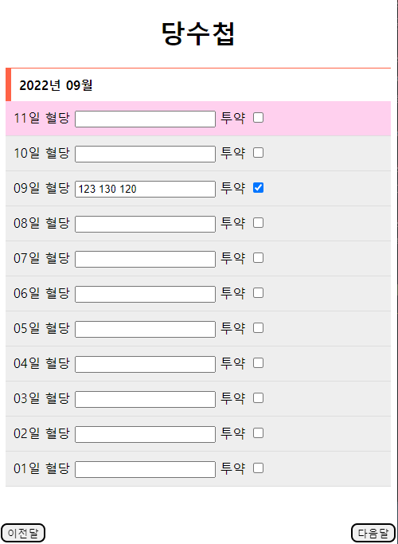

## 당노트 (Dang-note)

## 설명

당클린 프로젝트를 진행하기 전에 간단하게 만들어본 당노트입니다.  
node(expressjs)로 간단하게 웹서버를 구축해서 진행했습니다.

## 기능

◎ 당수치 기록  
날짜별 당수치를 간단하게 기록할 수 있습니다.

◎ 오늘 날짜까지만 보이도록 구현

## 데모 이미지



## 설치

```bash
 $ npm i
```

## 실행

```bash
 $ npm start
```

또는

```bash
 $ yarn start
```
